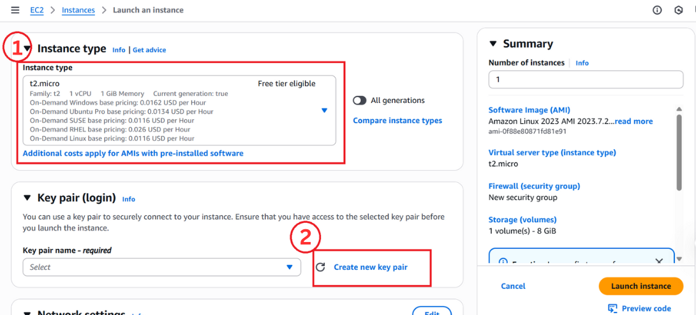

## Getting started
Before you begin this lab, make sure you have an active AWS Free Tier account and a stable internet connection. Once you're ready, follow each task step-by-step to launch your EC2 instance.

### **Lab 01: Launch an EC2 Instance in AWS**
Estimated Time: 30–45 minutes 

### Lab Overview
An Amazon Elastic Compute Cloud (EC2) instance is a scalable computing resource provided by Amazon Web Services (AWS). EC2 allows users to launch and manage virtual servers in the cloud, enabling them to run applications, host websites, and perform compute tasks without investing in physical hardware.

### Lab Objectives

In this lab, you will be able to complete the following tasks:

- Launch an EC2 instance in the AWS Management Console.
- Connect to the instance using SSH (Linux).

#### Task 01: Create an EC2 instance

In this task, we will launch an Amazon Linux EC2 instance

1. On the **AWS Management Console**, use the search bar at the top to enter **EC2** (1), then select **EC2** (2) under Services to open the EC2 Dashboard. .png)
   
2. In the **Name and tags** (1) section, locate the Name field, type a name for your EC2 instance (example: MyFirstEC2Instance). In the **Application and OS Images (Amazon Machine Image)**, under the Quick Start tab, click on **Amazon Linux** (2). 
  
3. In **Select Instance Type** (1), choose t2.micro (1 vCPU, 1 GiB Memory), which is Free tier eligible. Under Key pair (login), click on **Create new key pair** (2). 

4. To securely connect to your EC2 instance, create a new key pair. **Enter a Key Pair Name ** (1) (example: xyz). In **Choose Key Pair Type** , select **RSA** (2). Choose **.pem** (3) in the **Select Private Key Format**. Then click **Create key pair** (4). 

